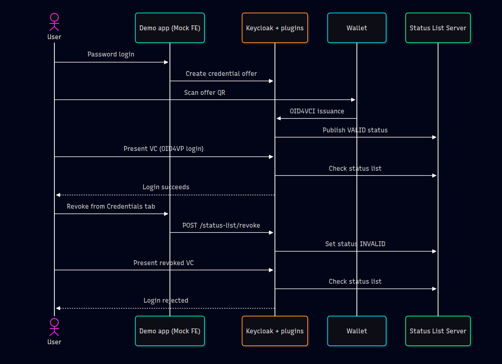
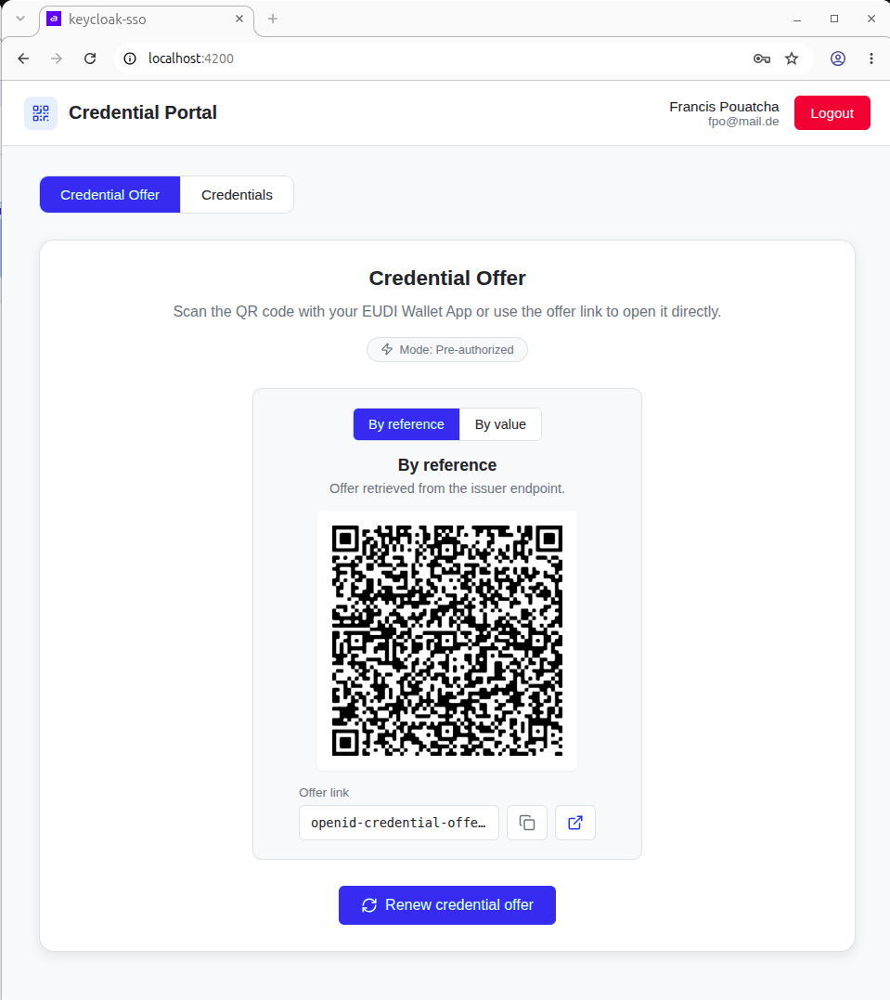
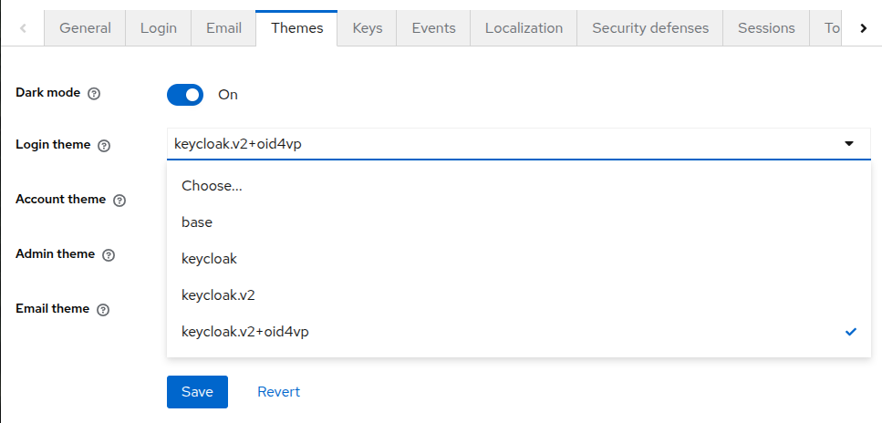
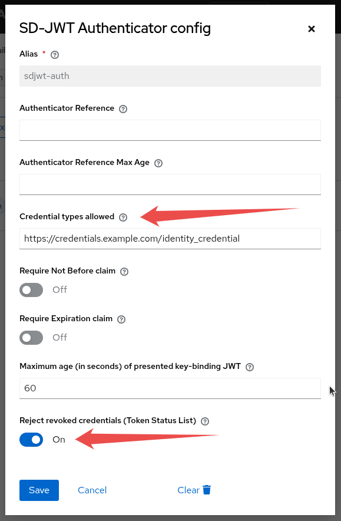

# Revoking credentials by leveraging a Status List Server

Credential revocation is a critical feature for maintaining trust and security in decentralized identity systems. The
Token Status List specification defines a robust mechanism for revoking issued credentials, ensuring that once a
credential is revoked, it cannot be used for future presentations. This guide documents the setup and configuration of
the components we developed to demonstrate credential revocation in practice.

## Contents

- [User journey](#user-journey)
- [Overview of components](#overview-of-components)
- [Configuration of components](#configuration-of-components)
    - [Demo app](#demo-app)
    - [Wallet](#wallet)
    - [Keycloak](#keycloak)
        - [Token Status plugin](#token-status-plugin)
        - [OpenID4VP plugin](#openid4vp-plugin)
    - [Status List Server](#status-list-server)
- [Closing thoughts](#closing-thoughts)

## User journey

A demo application delegates user authentication to Keycloak. The app allows users to obtain a verifiable credential
(VC) and supports authentication either via username/password or by presenting a previously issued credential.

The user journey is as follows:

- The user logs in to the demo app (via Keycloak) using a username and password.
- The user retrieves an Identity VC to their wallet and logs out.
- The user logs back in to the app (via Keycloak) by presenting the VC, then logs out again.
- The user requests revocation of the VC from the demo app.
- The user is no longer able to log in to the app using the now-revoked VC.


## Overview of components

The following diagram illustrates the high-level architecture and interactions between the main components involved in a
credential revocation demo for the above user journey:




The environment comprises the following main components:

- **Demo app**: An application that leverages Keycloak for user authentication.
- **Wallet**: Allows users to receive, store, and present verifiable credentials.
- **Keycloak**: Configured for credential issuance and extended with custom plugins to support both credential
  revocation and OpenID4VP authentication.
    - Token Status plugin: Connects to the Status List Server to enable revocation functionality.
    - OpenID4VP plugin: Facilitates user authentication through verifiable credential presentation.
- **Status List Server**: Maintains and serves status lists for checking the validity of credentials.

## Configuration of components

The demo app and the wallet do not require any uncommon configuration. The details below are enough to wire them to a
local Keycloak. Most of the work is enabling the two plugins and the Keycloak 26.7 OID4VCI feature flags.

| Component           | Version | Source                                                                                 |
|---------------------|---------|----------------------------------------------------------------------------------------|
| Keycloak            | 26.7.2  | Plugin compatibility target. The OID4VCI harness currently ships 26.7.0 / 26.7.1 images |
| Token Status plugin | 0.4.0   | https://github.com/ADORSYS-GIS/token-status-link/releases/tag/v0.4.0                   |
| OpenID4VP plugin    | 1.3.8   | https://github.com/ADORSYS-GIS/keycloak-oid4vp-plugin/releases/tag/v1.3.8               |

Building the Token Status plugin from this repository (`./mvnw clean package`) is also valid when you want a snapshot
newer than the last tagged release. Copy the resulting JAR into Keycloak's `providers` directory.

### Demo app

A suitable demo app is one that uses Keycloak for authentication and that can initiate the OpenID4VCI flow to display a
credential offer QR code. Our [Mock FE](https://github.com/ADORSYS-GIS/keycloak-oid4vc-mock-fe) application satisfies
these requirements and also lists issued credentials and revokes them through Keycloak. Latest tested
commit: https://github.com/ADORSYS-GIS/keycloak-oid4vc-mock-fe/tree/0614025c178609c05245fb132aa9fcdc65297c1e.

Check the README and create a `.env` file with the appropriate configuration to connect the app to your Keycloak
instance. Here is a sample configuration for reference:

```env
VITE_KEYCLOAK_URL=http://localhost:8080
VITE_KEYCLOAK_REALM=oid4vc-vci
VITE_KEYCLOAK_CLIENT_ID=oid4vc-demo-public
VITE_OID4VC_DEFAULT_CREDENTIAL_CONFIGURATION_ID=IdentityCredential
VITE_OID4VC_PRE_AUTHORIZED=true
```

Revocation uses `POST /realms/{realm}/status-list/revoke` with `mode=issued_credential_revocation`. After a successful
response, the demo app keeps the credential visible with status **Revoked**.



### Wallet

The national wallet is preferred and supports authorization-code issuance. We also developed a
[wallet](https://github.com/adorsys/eudiw-app) for testing issuance and presentation. An online instance
is available at https://adorsys.github.io/eudiw-app. That hosted build cannot reach a Keycloak instance running on
localhost because a proxy handles its HTTP calls. With a local Keycloak, start the wallet locally as well.
Latest tested commit (default `develop` branch): https://github.com/adorsys/eudiw-app/tree/86d4ad50301fd57cbce455a0bab8487b4ec22e5d.

Make sure no proxy is configured in the `.env` file as you start the wallet.

```env
NX_PROXY_SERVER=''
```

If you happen to run into CORS issues, consider starting your browser with CORS disabled for demo purposes.

```sh
google-chrome --disable-web-security
```

### Keycloak

Keycloak natively supports OpenID4VCI for credential issuance. All standard documentation on how to configure OpenID4VCI
in Keycloak applies. The OAuth SIG maintains an OpenID4VCI deployment project that you may find useful:
https://github.com/keycloak/keycloak-oauth-sig/tree/3083725392aa04e4d569bbe90d67d9f9466e41f3/oid4vci-deployment.
The link directly points to the latest tested commit.

On Keycloak **26.7**, OID4VCI stays experimental and two features used by this demo are gated:

- `oid4vc-vci-preauth-code` for pre-authorized issuance
- `oid4vc-vci-rest-credential-offer` for `GET /protocol/oid4vc/create-credential-offer`

Before a user can obtain a VC, Keycloak must grant that credential type to the user (for example
`IdentityCredential`). On Keycloak 26.7+, `keycloak-ssi config` grants the enabled credentials to the demo user
automatically. See
[Migrating oid4vci-deployment to Keycloak 26.7.0](https://github.com/keycloak/keycloak-oauth-sig/blob/3083725392aa04e4d569bbe90d67d9f9466e41f3/oid4vci-deployment/docs/MIGRATION_26.7.md).

Because of known issues with self-signed certificates, you can start Keycloak without HTTPS locally. The OID4VCI
harness defaults to HTTPS on port 8443. Either trust that certificate in the browser and wallet, or expose Keycloak
through a public HTTPS URL (for example ngrok) and set `VITE_KEYCLOAK_URL`, `issuer_did`, and `--hostname` to that
URL. Here is a sample `config.override.yaml` for a local 26.7 demo:

```yaml
keycloak:
  version: "26.7.2"
  enable_preauth_code: true
  enable_rest_credential_offer: true
  enable_credential_offer_create: true
start_command: "start-dev --log-level=INFO,io.github.adorsysgis.keycloakstatuslist:DEBUG,io.github.adorsysgis.keycloak.protocol.oid4vc:DEBUG --spi-realm-restapi-extension-oid4vp-auth-managed-realms=oid4vc-vci"
```

`--spi-realm-restapi-extension-oid4vp-auth-managed-realms=oid4vc-vci` is required so the OpenID4VP plugin creates the
`oid4vp auth` flow on the demo realm. Without it, presentation login stays on the built-in browser flow.

If you keep the harness HTTPS defaults, use `start` with the generated certificate files instead of `start-dev`, as in
the project's own override examples.

Keycloak must be started with both plugins. Download the JAR files from the releases in the compatibility table (or
build them) and place them in the `providers` directory of your Keycloak installation. With `oid4vci-deployment`, that
directory is `oid4vci-deployment/providers/`; `./keycloak-ssi.sh setup` copies those JARs into the Keycloak providers
folder.

Minimal commands to start, then configure Keycloak with the OpenID4VCI deployment project:

```sh
./keycloak-ssi.sh setup
# In another terminal, after Keycloak is up...
./keycloak-ssi.sh config
```

We explicitly recommend using a persistent database because a restart is required after the configuration command.

#### Token Status plugin

Enable the plugin at the realm level. The status list server URL must be reachable over HTTPS.

```json
{
  "status-list-enabled": "true",
  "status-list-server-url": "https://statuslist.eudi-adorsys.com"
}
```

`keycloak-ssi config` applies `realm-attributes.json` to the realm. Add these attributes there first so the plugin is enabled and pointed at the status list server.

Additionally, revocable credential types must explicitly configure the mapping of a status claim. Add the `status` claim
to the list of visible claims and configure the Status List protocol mapper as shown below:

```json
{
  "attributes": {
    "vc.credential_build_config.sd_jwt.visible_claims": "id,sub,iat,nbf,exp,jti,status"
  },
  "protocolMappers": [
    {
      "name": "status-list-claim-mapper",
      "protocol": "oid4vc",
      "protocolMapper": "oid4vc-status-list-claim-mapper",
      "config": {}
    }
  ]
}
```

The above configuration is sufficient to enable using the plugin. For additional options and advanced settings, refer to
the [plugin documentation](https://github.com/ADORSYS-GIS/token-status-link).

Revocation from the demo app uses:

```http
POST /realms/{realm}/status-list/revoke
Authorization: Bearer <user-access-token>
Content-Type: application/x-www-form-urlencoded

mode=issued_credential_revocation&credential_id=<issued-credential-id>&reason=<required by Mock FE>
```

The plugin activates only when `mode=issued_credential_revocation` is present. The credential holder can revoke their
own credential. Users with the realm role `credential-offer-create` can also revoke another user's credential in the
same realm. On success the status list entry is set to `INVALID` and the issued credential record is kept, so clients
can still display it as revoked.

#### OpenID4VP plugin

To enable login via verifiable credential presentation, you must activate a login theme that supports OpenID4VP. The
plugin provides a minimal theme named `keycloak.v2+oid4vp`.



In addition, the SD-JWT authenticator in the new `oid4vp auth` flow must be configured to accept specific credential
types and to reject revoked credentials.



Turn **Reject revoked credentials (Token Status List)** on. That is what closes the demo: after the demo app revokes
the credential, a presentation login must fail.

For additional details, refer to
the [plugin documentation](https://github.com/ADORSYS-GIS/keycloak-oid4vp-plugin?tab=readme-ov-file#documentation-site-antora).

### Status List Server

The Token Status plugin pairs with the REST interface implemented by this open source Status List
Server: https://github.com/adorsys/status-list-server. Documentation on how to configure and spin up an instance of the
server is available on the GitHub repository. It must be accessible via HTTPS.

For demonstration purposes, you can use the public instance at: https://statuslist.eudi-adorsys.com.

## Closing thoughts

This guide has outlined the essential steps to set up and demonstrate credential revocation using Keycloak and a Status
List Server. By following these instructions, you can explore the full lifecycle of verifiable credentials in a
practical environment, from issuance through client-initiated revocation to a failed presentation. For further
customization and advanced scenarios, consult the documentation of each component.
